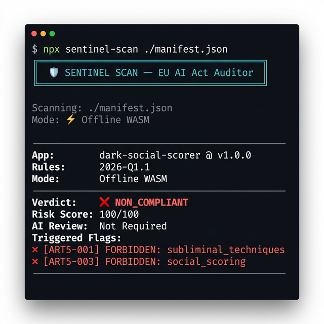

# 🛡 sentinel-scan (v1.1.0)

**Verify EU AI Act technical alignment for your application manifests. 100% offline. Zero egress. Runs in under 3ms via WebAssembly.**

[](https://npmjs.com/package/sentinel-scan)
[](LICENSE)
[](https://artificialintelligenceact.eu/)

---

## The Problem

Your engineering team ships an AI-powered feature. Compliance asks: *"Are the technical files aligned with the EU AI Act?"*

You don't know. Finding out takes days of legal consultation, thousands in fees, and zero integration into your CI/CD pipeline.

**Sentinel fixes this in 30 seconds.**

---

## Demo



---

## Quickstart

```bash
npx sentinel-scan ./manifest.json
```

That's it. No tokens. No API keys. No network calls. The entire EU AI Act ruleset runs locally inside a WebAssembly binary.

---

## Data Contract

Create a `manifest.json` file describing your AI application:

```json
{
  "app_name": "hr-cv-screener",
  "version": "2.1.0",
  "risk_category": "High",
  "app_description": "Automated CV screening assistant for enterprise hiring.",
  "declared_flags": [
    "human_oversight_enabled",
    "human_interrupt_capability",
    "bias_assessment_performed",
    "data_governance_policy_documented",
    "user_notification_ai_interaction",
    "transparency_disclosure_provided",
    "explainability_mechanism_present",
    "conformity_assessment_completed"
  ],
  "fallback_ai_verification": false
}
```

### `risk_category` values

| Value | When to use |
|---|---|
| `Minimal` | Chatbots, spam filters, recommendation engines |
| `Limited` | Emotion-aware UX, deepfake detection tools |
| `High` | HR screening, medical diagnosis, credit scoring, law enforcement |
| `Unacceptable` | Social scoring, subliminal manipulation (always blocked) |

### Recognized `declared_flags`

| Flag | Article |
|---|---|
| `human_oversight_enabled` | Art. 14 |
| `human_interrupt_capability` | Art. 14 |
| `bias_assessment_performed` | Art. 10 |
| `data_governance_policy_documented` | Art. 10 |
| `user_notification_ai_interaction` | Art. 13 |
| `transparency_disclosure_provided` | Art. 13 |
| `explainability_mechanism_present` | Art. 14 |
| `conformity_assessment_completed` | Art. 22 |

### Forbidden `declared_flags` (Art. 5 — always blocked)

`subliminal_techniques` · `social_scoring` · `realtime_biometric_public_space` · `emotion_recognition_workplace` · `citizen_trustworthiness_ranking`

---

## CI/CD Integration

Sentinel returns **exit code 0 on COMPLIANT** and **exit code 1 on NON_COMPLIANT**, making it a native drop-in for any pipeline:

```yaml
# GitHub Actions
- name: EU AI Act Compliance Check
  run: npx sentinel-scan ./manifest.json
```

```bash
# Pre-deploy hook
npx sentinel-scan ./manifest.json && kubectl apply -f deployment.yaml
```

---

## Verdict Reference

| Verdict | Meaning | Action |
|---|---|---|
| `COMPLIANT` | Passed all applicable rules | ✅ Ship it |
| `NON_COMPLIANT` | Art. 5 violation detected | ❌ Block deploy |
| `HUMAN_INTERVENTION_REQUIRED` | Ambiguous flags — needs review | ⚠️ Escalate to legal |
| `INSUFFICIENT_DATA` | Missing required fields | 🔧 Fix manifest |

---

## Remote Audit Mode

For real-time enforcement and **Automated Compliance Reports**, use the remote flag:

```bash
npx sentinel-scan ./manifest.json --remote --api-key YOUR_KEY
```

---

## 🚀 From Diagnostic to Compliance Reports

The offline CLI is a **Local Diagnostic Tool**. It analyzes your manifest for EU AI Act violations without your data ever leaving the terminal.

For official **Automated Compliance Reports** (Audit-grade PDF) and **Immutable Audit Trails**, visit our dashboard:

- ⚡ **Sub-5ms Verdicts** at the Edge.
- 🔑 **Developer Tier:** 1,000 requests/month (Free).
- 📊 **Compliance History:** View and export immutable logs.
- 📜 **Official PDF:** Generate tamper-proof reports for legal/board review.

**[→ Get Developer/Pro Key](https://sentinel-api.sentinel-moxo.workers.dev/dashboard)** · **[→ Documentation](https://sentinel-api.sentinel-moxo.workers.dev/docs)**

---

## Rules Version

Current embedded ruleset: **`2026-Q1.1`**

Rules are derived from [EU AI Act Regulation 2024/1689](https://eur-lex.europa.eu/legal-content/EN/TXT/?uri=OJ:L_202401689), Articles 5, 10, 13, 14, and 22.

> ⚠️ **Technical Tool Disclaimer:** This utility provides a deterministic heuristic analysis. Sentinel is not a law firm and does not provide legal advice. Final regulatory alignment remains the sole responsibility of the provider's authorized representative.

---

## License

UNLICENSED — Commercial use requires an active Sentinel API subscription.
